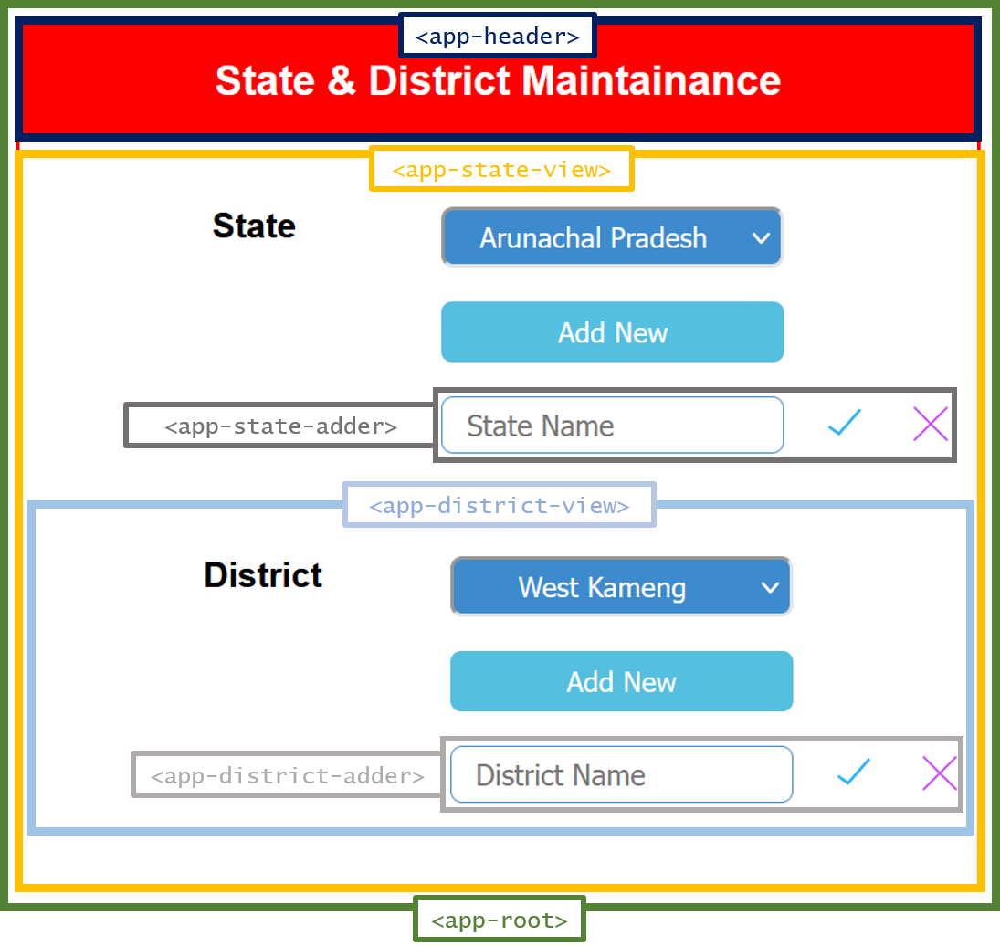

# State & District Maintainance

A webpage to maintain state & district using HTML, CSS and Angular

## Components overview

<div>
    
</div>

App components:
* **`<app-root>`**: The root component which angular includes by default in [index.html](./src/index.html)
    * **`<app-header>`**: This is the heading of the page cotaining the title- "State & District Maintainance"
    * **`<app-state-view>`**: This provides the interface to view states from a dropdown menu. It has two child components:
        * **`<app-state-adder>`**: On clicking the <kbd>Add New</kbd> button, this component appears showing an input box, ✔️ (add button) and ❌ (cancel button).  
        Add a new state into the states list using this component.
        * **`<app-district-view>`**: To view districts under the selected state. Has one child component:
            * **`<app-district-adder>`**: Same as `<app-state-adder>`, but adds a district under the selected state from input box.

## `state-district.service`

The states and districts in the app are provided by the [state-district service](./src/app/state-district.service.ts). The app is just a frontend so it stores the state & districts in `STATES` array- a property of the state-district service.

State and District are implemented in [place.ts](./src/app/place.ts):
```ts
export interface State {
    id: number;
    name: string;
    districts: District[];
}

export interface District {
    id: number;
    name: string;
}
```

### Properties:
* `STATES: State[]`: An array of `State`. States and districts in the app are provided from here.

### Methods:
* `getStates()`: Returns the `STATES` array.
* `addState(stateName: string)`: Creates a `newState` provided the name of the state and appends to the `STATES` array.
* `getDistricts(stateId: number)`: Returns the list of districts under a state provided the `stateId`.
* `addDistrict(stateId: number, districtName: string)`: Creates a district using the `districtName` provided and appends to the list of districts under the state having id of `stateId`.

## Reference

### Interfaces
* **State, District:**
    * TS file: [place.ts](./src/app/place.ts)

### Services
* **state-district service:**
    * TS Class: [state-district.service.ts](./src/app/state-district.service.ts)

### Components

* **app-state-view:**
    * TS Class: [state-view.component.ts](./src/app/state-view/state-view.component.ts)
    * Template: [state-view.component.html](./src/app/state-view/state-view.component.html)
* **app-state-adder:**
    * TS Class: [state-adder.component.ts](./src/app/state-adder/state-adder.component.ts)
    * Template: [state-adder.component.html](./src/app/state-adder/state-adder.component.html)
* **app-district-view:**
    * TS Class: [district-view.component.ts](./src/app/district-view/district-view.component.ts)
    * Template: [district-view.component.html](./src/app/district-view/district-view.component.html)
* **app-district-adder:**
    * TS Class: [district-adder.component.ts](./src/app/district-adder/district-adder.component.ts)
    * Template: [district-adder.component.html](./src/app/district-adder/district-adder.component.html)